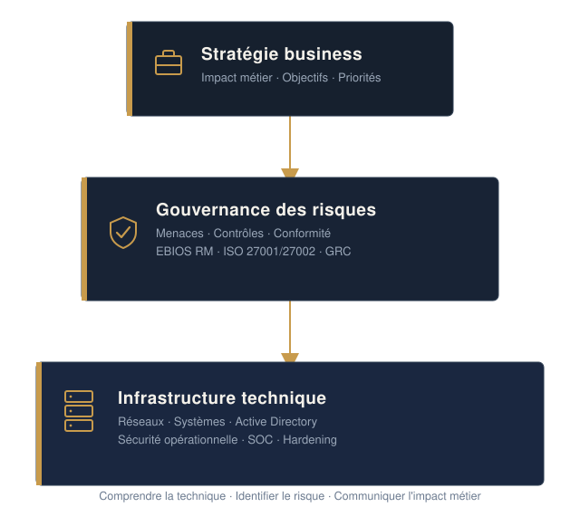

# Je suis Jules Oscar MBEKAL,
---
### Analyste Cybersécurité · Audit SI · GRC · Gouvernance IT · Gestion des risques

---

> 🇫🇷 [**Français**](#-français)   |   🇬🇧 [**English**](#-english)
🇫🇷 Français

---

##  À PROPOS DE MOI

Mon parcours combine une approche technique de la cybersécurité, réseaux, systèmes, SOC, gestion des vulnérabilités, pentest et durcissement avec une orientation croissante vers **la GRC, l'audit IT, la gestion des risques et la gouvernance de la sécurité**.

**Je recherche une alternance de 12 mois** à partir de **Septembre 2026** au **Rythme : 3 semaines entreprise / 1 semaine école*

---
## Langues

- **Français** — langue maternelle
- **Anglais** — niveau C1, [TOEIC 905/990](/documents/TOEIC-Oscar.pdf)

---

 Ma vision de la cybersécurité s'articule autour de trois dimensions indissociables :

 

---

##  Expériences professionnelles

### Ingénieur chercheur en cybersécurité — ICAM Nantes
*Janvier 2026 – Juin 2026*

**Réalisations :**
- Conception et orchestration d'une plateforme OSINT multi-sources intégrant +7 outils dédiés
- Développement d'un dashboard interactif d'analyse de données alimenté par l'IA (filtres avancés, visualisation de données)
- Déploiement et sécurisation de l'infrastructure (Docker, Cloud, monitoring, MFA/2FA, chiffrement, IAM, logging)
**Impacts clés :**
- Optimisation globale des méthodes de veille et de recherche en cybersécurité (offensive et défensive)
- Sensibilisation et montée en compétences de plus de 100 étudiants sur les enjeux OSINT
**Compétences :** OSINT · Analyse de données · IA appliquée à la cybersécurité · Orchestration d'outils · Docker · Dashboarding · IAM · MFA/2FA · Cloud · Monitoring
  
  [Voir le projet ](video/Sentinel.mp4)

### Assistant Sécurité SI — Wafacash Central Africa
*Août 2024 – Janvier 2025*
**Réalisations :**
- Conduite d'analyses de risques multisites via la méthode EBIOS RM sur l'ensemble du réseau d'agences
- Identification des écarts et rédaction des plans d'amélioration pour la mise à jour de la PSSI
- Déploiement de dispositifs de surveillance, de contrôle de conformité des systèmes et de reporting pour la direction
- Copilotage du projet de mise à jour du SI sur 8 serveurs (150+ postes impactés)
**Impacts clés :**
- Modernisation des outils métiers et réduction des délais de traitement opérationnels
- Priorisation des actions de sécurisation et renforcement de la conformité globale du SI
**Compétences :** EBIOS RM · Analyse de risques IT · Risk Management · Audit SI · GRC · Conformité SSI · Gap Analysis · PSSI · KPI & Reporting · Pilotage de projet

### Ingénieur cybersécurité junior — Wise Computers
*Janvier 2024 – Mars 2024*
**Réalisations :**
- Déploiement et administration d'un dashboard OpenVAS pour la gestion des vulnérabilités d'un parc de 80 machines
- Réalisation de tests d'intrusion (boîte grise) et correction directe des vulnérabilités
- Surveillance des événements, analyse des alertes, détection et réponse aux incidents en tant que SOC Analyst
- Création de KPI de sécurité, actualisation des procédures et animation d'ateliers de sensibilisation
**Impacts clés :**
- Réduction de 30 % du délai moyen de remédiation des vulnérabilités (passage de 5 à 2 jours)
- Élimination des vulnérabilités critiques du parc informatique
**Compétences :** Vulnerability Management · Threat Intelligence · OpenVAS/Greenbone · Pentest Grey Box · Audit SSI · SOC · Security Monitoring · Incident Response · Remédiation · KPI de sécurité · Sensibilisation cybersécurité

### Assistance support — Numtek
*Avril 2023 – Juin 2023*
**Réalisations :**
- Assistance support informatique auprès des utilisateurs
- Mise en place d'un Active Directory pour l'authentification des employés
- Déploiement d'un serveur de fichiers ainsi qu'un portail captif pour l'authentification des employés
**Compétences :** Active Directory · Support informatique · Serveur de fichiers · Portail captif
  
---

##  Projets académiques et annexes

### Wi_Grow — agriculture connectée au Cameroun
*IoT · drones · IA · vision par ordinateur*
- Plateforme technologique de suivi agricole combinant capteurs sol, 
- imagerie drone et détection IA de maladies/nuisibles, présenté au salon ETSIA.
  
[Voir le projet ](documents/WI_grow.pdf)

### Projet d'annuaire et Supervision
- Mise en place et supervision d'une architecture d'annuaire reposant sur **Active Directory** :
- Installation d'un contrôleur sous **Windows Server**
- Création des **GPO**
- Supervision des serveurs à l'aide de **Centreon**
- Mise en place d'un **réseau MPLS multisites**

### YANSNET — Architecture Réseau & Infra Applicative

- Conception de l'infrastructure système, réseau et télécom destinée à supporter un réseau social étudiant. 
- Ingénierie de l'interconnexion sécurisée entre les cités universitaires et le campus principal.

---
## Compétences globales

### Audit & GRC

### Sécurité opérationnelle

### Infrastructure & Automatisation

### **Sensibilisation & pédagogie** 

Animation d'ateliers de sensibilisation à la cybersécurité

---

## Formation

|Année | Etablissement | Filière |
|**2026 - 2027| Université de Technologie de Troyes (UTT) |  Mastère Spécialisé® Audit de la Sécurité des SI | 
|**2021 - 2026** | ICAM | Ingénieur en informatique, spécialisation Réseau & Cybersécurité (Bac+5) |

---
##  Objectifs et certifications

**Certifications :**
- Fortinet Certified Associate
- Fortinet Certified Fundamentals
- CCNA
- Cisco Junior Cybersecurity Analyst
- Six Sigma Yellow Belt
- Scrum Fundamental Certification
- Prince2
  
---

##  Au-delà de la Cybersécurité
* **DJing & Event Tech :** Exploration de solutions technologiques pour simplifier l'organisation événementielle et la relation artistes/clients.
* **Entrepreneuriat & Tech en Afrique :** Prototypage de solutions adaptées aux enjeux du continent (Agriculture connectée, cybersécurité, services numériques).
---

##  Contact
Recherche active d'une **alternance de 12 mois dès Septembre 2026** sur les postes :
**Auditeur SSI Junior · Assistant RSSI · Assistant Chef de Projet Sécurité / GRC · Analyste Risk Management**
*  **Email :** [Olsenick.mbekal@gmail.com](mailto:Olsenick.mbekal@gmail.com)
*  **Téléphone :** +33 7 54 75 97 52
*  **LinkedIn :** [jules-oscar-olsenick-mbekal](https://www.linkedin.com/in/jules-oscar-olsenick-mbekal-771a84267/)

# 🇬🇧 English

---

> ### *"Cybersecurity is not only about protecting systems. It is about understanding what matters, identifying what can go wrong, and enabling better decisions."*

---

**Cybersecurity · Risk · Infrastructure · Intelligence**

